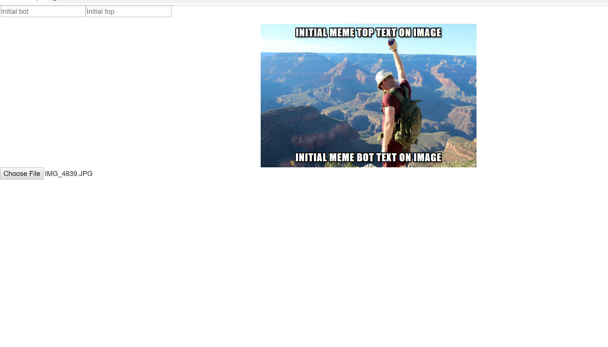
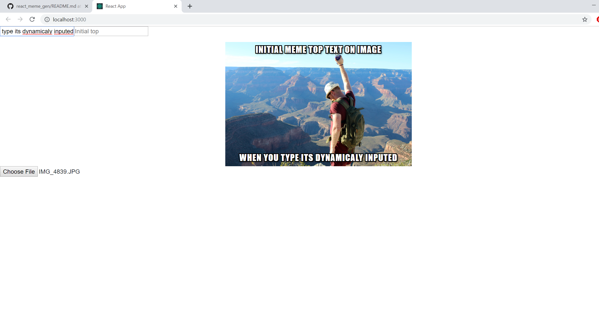

## Description
Simple, small web app, for IBM internship.

### Technologies 

- Node.js (Creating backend server and express app)
- React (for front-end)

---
## How to use

### Installation
First You have to install prerequisites like node.js enviroment, it can be done via link :

[https://nodejs.org/en/](https://nodejs.org/en/)

Then download the app solution to local drive.
Locate it in command line, and run following code line 

`npm start `

Check if server is runnning on cmd line and if it does access local host with port 3000.

`http://127.0.0.1:3000/`

### Using the app

Usage of this app is much simplier then the one I've created with only JavaScript,
You can either choose to go with default image, that's been generated when initialized or upload Your own.

After You upload file or choose to go with default one, whenever You type text into input nodes,
it's going to appear on image, like so:

  
## Things to fix up.

- Uploaded images are in default parameters like (width and length).
- Still need to somehow upload node_modules.

